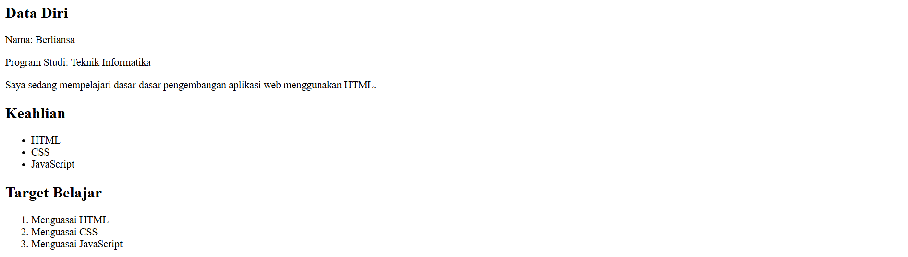
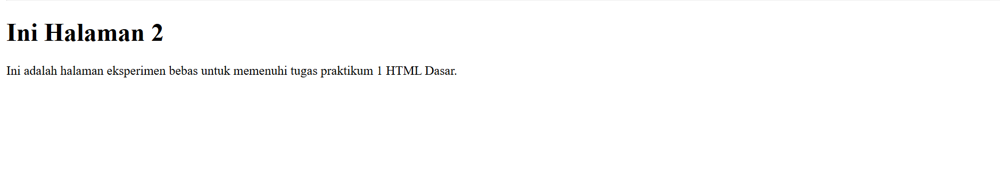

# Laporan Praktikum 1 - HTML Dasar

*Nama:* Berliansa  
*Mata Kuliah:* Pemrograman Web  
*Kampus:* Universitas Pelita Bangsa  

---

## Dokumentasi Langkah Praktikum & Hasil

### Langkah 1: Membuat Struktur Utama Halaman Web
Pada tahap ini, dilakukan pembuatan file index.html dan penyusunan elemen dasar HTML5. Ditambahkan heading judul utama menggunakan tag h1, tag paragraf p untuk deskripsi awal, serta tag img untuk menyisipkan gambar foto profil mahasiswa.

### Langkah 2: Menambahkan Konten Data Diri dan Format Daftar (List)
Pada tahap ini, konten halaman dilengkapi dengan data diri mahasiswa. Menggunakan tag unordered list (ul) untuk menampilkan poin keahlian tanpa nomor, serta tag ordered list (ol) untuk menyusun target belajar secara berurutan dengan penomoran otomatis.

### Langkah 3: Membuat Navigasi dan Halaman Kedua (Hyperlink)
Langkah terakhir adalah membuat file halaman2.html untuk memenuhi kebutuhan halaman eksperimen bebas. Kedua halaman tersebut kemudian dihubungkan secara internal menggunakan tag navigasi (nav) dan tag anchor (a) dengan atribut href agar dapat berpindah halaman tanpa eror.

---

## Jawaban Pertanyaan Praktikum

### 1. Apa fungsi deklarasi DOCTYPE html pada dokumen HTML?
Untuk memberi tahu browser bahwa dokumen tersebut menggunakan standar HTML5 agar browser dapat merender halaman dengan benar.

### 2. Apa perbedaan antara tag, elemen, dan atribut pada HTML?
* Tag: Penanda awal atau akhir elemen (contoh tag p pembuka dan tag p penutup).
* Elemen: Komponen utuh yang berisi tag pembuka, isi teks, hingga tag penutup (contoh elemen p berisi tulisan Halo).
* Atribut: Informasi tambahan yang ditulis di dalam tag pembuka (contoh atribut src pada tag img).

### 3. Apa perbedaan tag p dengan tag br? Jelaskan penggunaannya.
* Tag p digunakan untuk membuat paragraf baru yang otomatis memberikan jarak baris kosong di bawahnya.
* Tag br digunakan hanya untuk memutus baris teks agar pindah ke bawah langsung tanpa ada jarak paragraf.

### 4. Apa fungsi atribut href pada tag a?
Untuk menentukan alamat URL atau tujuan halaman web yang akan dibuka saat link tersebut diklik.

### 5. Apa perbedaan hyperlink ke halaman internal dengan hyperlink ke website eksternal?
* Internal: Menghubungkan ke file HTML lain yang berada di dalam folder proyek yang sama (contohnya halaman2.html).
* Eksternal: Menghubungkan ke situs web lain di internet memakai alamat URL lengkap (contohnya ke website Google).

### 6. Apa fungsi atribut src dan alt pada tag img?
* Atribut src berfungsi untuk menentukan lokasi jalur atau nama file gambar yang mau ditampilkan.
* Atribut alt berfungsi menampilkan teks alternatif pengganti jika gambar gagal dimuat atau dibaca oleh sistem pembaca layar.

### 7. Apa perbedaan penggunaan tag ul dan tag ol?
* Tag ul digunakan untuk membuat daftar poin dengan simbol atau bulat hitam dan tidak berurutan.
* Tag ol digunakan untuk membuat daftar poin berurutan menggunakan angka atau huruf.

### 8. Apa yang terjadi jika path gambar pada atribut src salah?
Gambar tidak akan muncul di halaman web browser dan hanya menampilkan ikon gambar rusak kecil beserta teks alt deskripsinya.

### 9. Mengapa struktur heading h1 sampai h6 perlu digunakan secara terstruktur?
Agar susunan informasi web menjadi rapi dan semantik, memudahkan pembaca memahami tingkatan judul utama dan sub-judul, serta membantu optimasi mesin pencari SEO Google.

### 10. Apa fungsi komentar dalam kode HTML?
Untuk memberikan catatan kecil atau penjelasan baris kode bagi pengembang (developer) karena bagian komentar ini otomatis diabaikan dan tidak akan ditampilkan oleh browser.